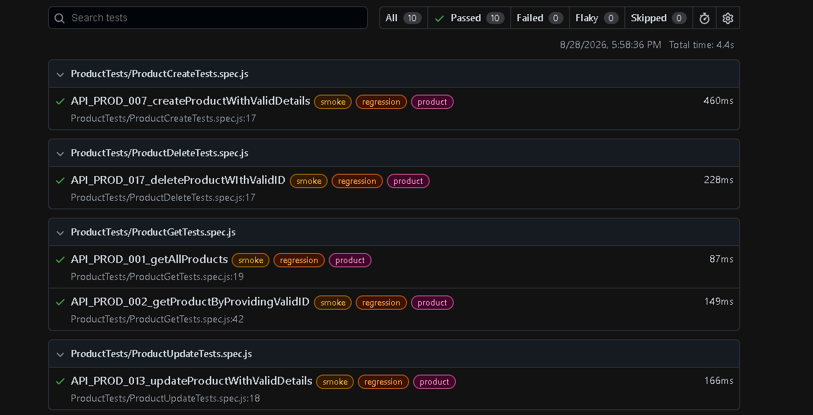
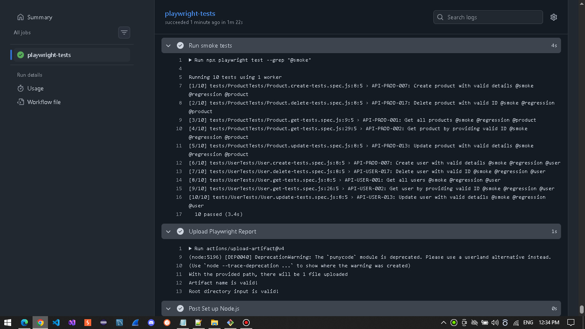

<a id="top"></a>
# 🎭 Project 6 – SOAP API Automation Framework (ShiftLeft-API)


> **Note:** This project is part of my personal QA Automation portfolio.

## Table of Contents

- [Overview](#overview)
- [Tech Stack](#tech-stack)
- [Framework Features](#framework-features)
- [Framework Architecture](#framework-architecture)
- [Test Execution](#test-execution)
- [Reports and Logging](#reports-and-logging)
- [Conclusion](#conclusion)

---

## 📖 Overview

A modular SOAP API automation framework built with JavaScript, Node.js, and Playwright.
The framework covers CRUD operations for the following SOAP services:
- Users
- Products

Both positive and negative scenarios are automated, including validation and boundary testing.

---

<a id="tech-stack"></a>
## 🛠️ Tech Stack

| Technology | Purpose |
|------------|---------|
| JavaScript | Scripting language used for test implementation |
| Node.js | JavaScript runtime environment |
| Playwright | API automation, HTTP request handling, test execution and assertions |
| fast-xml-parser | XML response parsing and deserialization |
| SOAP | API protocol under test |
| XML | Request payload templates and response format |

---

## ✨ Framework Features

- **Template Parameterization:** Runtime test data for dynamic request payloads
- **XML Response Deserialization:** XML response parsing using `fast-xml-parser`
- **Modular API Architecture:** Structured API services implemented with Playwright
- **Custom Playwright Fixtures:** Reusable request payloads through custom fixtures
- **Test Reporting:** Detailed reports using Playwright's built-in reporting
- **Logging:** Structured logging using Playwright's built-in capabilities
- Test execution control through **Playwright parameters**
- **GitHub Actions CI:** Two workflows for automated test execution — one manually triggered and one triggered on Pull Requests

---

<a id="framework-architecture"></a>
## 🏗️ Framework Architecture

The framework is organized into dedicated layers, each with a clear responsibility to improve
maintainability, reusability, and separation of concerns.


| Component | Purpose |
|-------------------|---------|
| Service | Encapsulates API endpoints and HTTP operations for each resource |
| Payload | Provides reusable SOAP request templates with placeholders |
| Fixtures | Provides ready-to-use payloads passed as parameters directly into each test|
| Test Data | Contains scenario-specific input data used to populate request templates |
| Expected | Centralizes expected status codes, headers, response values and validation messages |
| Tests | Contains test scenarios organized by API resource and operation |
| Utils | Provides generic methods for XML parsing, placeholder replacement and XML field manipulation |

---

## Test Execution

### Run All Tests

```bash
# All Tests (40 tests)
npx playwright test
```

### Run Specific Test Suite 

```bash
# Smoke Tests (8 tests)
npx playwright test --grep '@smoke'

# Test Service: Product service (20 tests) 
npx playwright test --grep '@product'
```

---

## Reports and Logging

### Reports

Test execution reports are generated using Playwright's built-in HTML reporter and located in the `report/` directory.

<details>
<summary>📊 <strong>Report Preview</strong></summary>

<br>



</details>

### Logs

Execution logs are generated using Playwright's built-in logging capabilities.

<details>
<summary>📝 <strong>Logs Preview</strong></summary>

<br>



</details>

---

## Conclusion

The main focus of this project was to demonstrate a solid understanding of core API Automation concepts, particularly 
SOAP API testing, and their practical application within a structured and configurable framework.

**Author:** [DoruSQA](https://github.com/DoruSQA) | [LinkedIn](https://www.linkedin.com/in/sava-doru/)
<p align="right"><a href="#top">Back to Top</a></p>